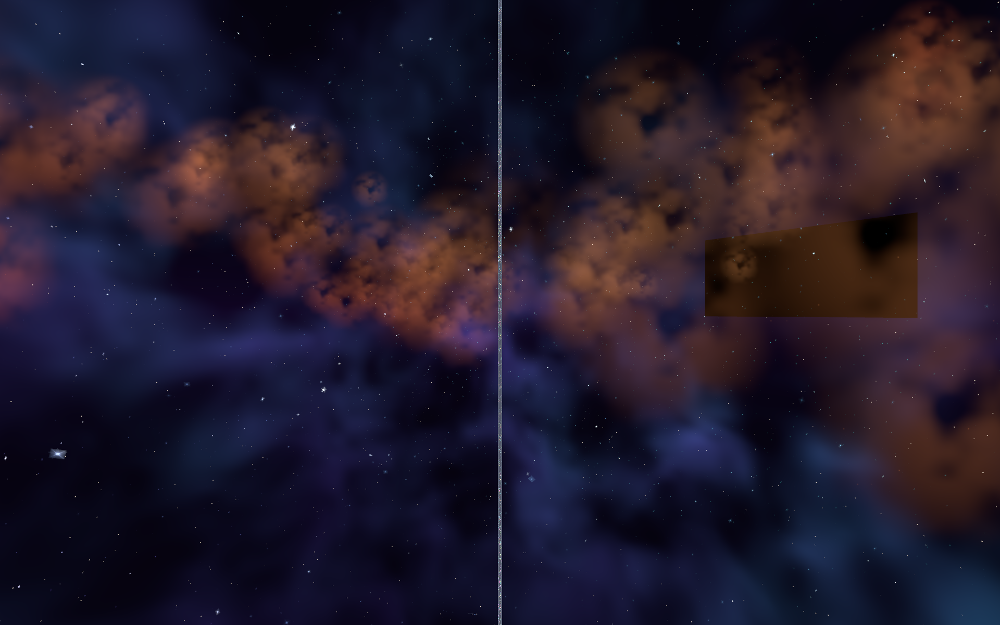
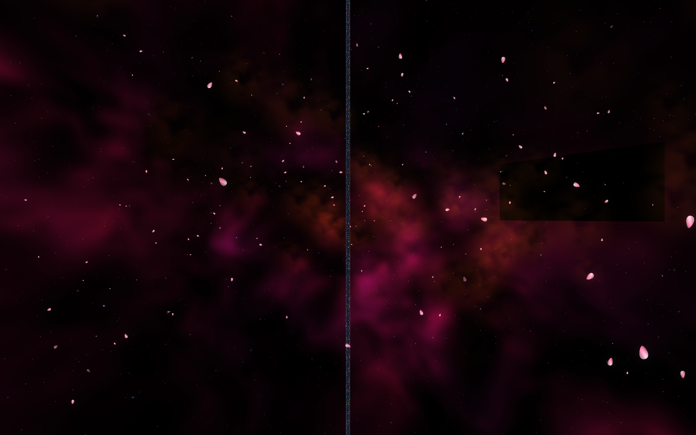

# Astra's Infinite Pole

PC VR / desktop world for findastra, built in Unity 2022.3.22f1 with VRChat Worlds SDK 3.10.5.

[Published VRChat world](https://vrchat.com/home/world/wrld_0d424078-5852-497d-adc6-c97436052355)

## Project

Open `Assets/Astra/Scenes/AstrasInfinitePole.unity`. The lean original is preserved in `AstrasInfinitePole_Lean.unity`. Use Creator Companion to restore the pinned VRChat packages from `Packages/vpm-manifest.json` before opening a fresh checkout.

- `Assets/Astra/Scripts`: Udon interaction and personal controls.
- `Assets/Astra/Shaders`: pole, glitter, clouds and celestial skies.
- `Assets/Astra/Editor`: scene builders, checks and publication tools.
- `Assets/ThirdParty`, `Assets/USharpVideo`: attributed assets and video player.
- `docs`: publication history, controls, and planned work.

## Development rules

Keep `.meta` files with their assets. Never commit Library, Temp, logs, credentials, caches or local publication flags. Restore external SDK packages using Creator Companion. Main represents reviewed source; use feature branches for changes and tags for releases actually uploaded and verified.

Scene-builder commands are for controlled upgrades, not a routine step when opening the project. The Magic builder refuses to overwrite an already upgraded scene. SDK sign-in stays local. Never run publication methods automatically in CI.

## Controls in the magic upgrade

In VR, bring your hands within 22 cm of each other near your chest or face, pause for about half a second, then pull them over 65 cm apart to summon or dismiss the spellbook. Holding both grips skips the pause. No grip buttons are required. It stays where summoned so the controls can be selected. On desktop, press M. Close hides the menu. Cloud palettes, body trails, player wake, swirl strength, translucent pole and crystal sparkle are personal controls.

## Validation

Unity/Udon build results and limitations are summarized in `docs/validation.md`. Online video availability, headset interaction, and frame time need live testing. A successful shader compile does not establish VR performance.

No general source license is granted yet. Third-party assets retain their own licenses; see `docs/third-party.md`.

Historical progress: [recovered milestones](docs/history/README.md). The repository is private; version links require collaborator access.

## Fine Magic — v0.4.0

The invisible floor is 96 metres across (four times the original diameter). Fine glitter and sparkling clouds follow the local player to maintain density across the larger area within the existing 11,980-particle maximum. The screen sits to the right of the central pole; solid pole depth prevents transparent surfaces behind it from drawing over it. Glitter uses tiny bright cores, narrow rays, staggered glints, color evolution and randomized orbital currents. Source is published at tag v0.4.0-fine-magic. Uploaded publicly on 2026-09-14 as VRChat world version 7.

## Pinkscape — v0.5.0 candidate

The pole has no collider. Open the hand menu (desktop M) for HOVER, PETALS, PINKSCAPE and BLOOM. Hover gently rises and falls over 24 seconds through a 0.6m range, remains optional, and restores gravity when disabled or respawned. Cherry blossom petals drift around the local player. Pinkscape selects rose clouds, a pink sky and a pastel glitter gradient. HDR bloom is enabled by default and can be disabled independently. Enclosure meshes are hidden. Particle capacity is 11,840 including petals, clouds and trails.

