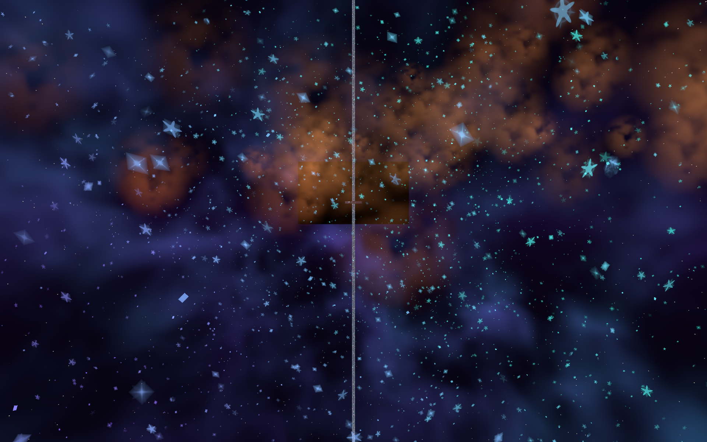
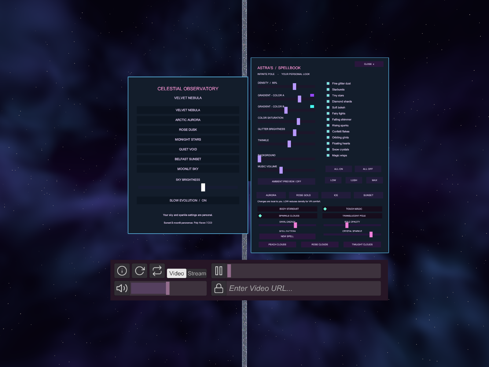

# Astra's Infinite Pole

PC VR / desktop world for findastra, built in Unity 2022.3.22f1 with VRChat Worlds SDK 3.10.5.

[Published VRChat world](https://vrchat.com/home/world/wrld_0d424078-5852-497d-adc6-c97436052355)

## Project

Open `Assets/Astra/Scenes/AstrasInfinitePole.unity`. The lean original is preserved in `AstrasInfinitePole_Lean.unity`. Use Creator Companion to restore the pinned VRChat packages from `Packages/vpm-manifest.json` before opening a fresh checkout.

- `Assets/Astra/Scripts`: Udon interaction and personal controls.
- `Assets/Astra/Shaders`: pole, glitter, clouds and celestial skies.
- `Assets/Astra/Editor`: scene builders, checks and publication tools.
- `Assets/ThirdParty`, `Assets/USharpVideo`: attributed assets and video player.
- `docs`: publication history, controls, and planned work.

## Development rules

Keep `.meta` files with their assets. Never commit Library, Temp, logs, credentials, caches or local publication flags. Restore external SDK packages using Creator Companion. Main represents reviewed source; use feature branches for changes and tags for releases actually uploaded and verified.

Scene-builder commands are for controlled upgrades, not a routine step when opening the project. The Magic builder refuses to overwrite an already upgraded scene. SDK sign-in stays local. Never run publication methods automatically in CI.

## Controls in the magic upgrade

In VR, hold both grips with hands less than 30 cm apart, then separate them beyond 65 cm to summon or dismiss the spellbook. It stays where summoned so the controls can be selected. On desktop, press M. Close hides the menu. Cloud palettes, body trails, player wake, swirl strength, translucent pole and crystal sparkle are personal controls.

## Validation

Unity/Udon build results and limitations are summarized in `docs/validation.md`. Online video availability, headset interaction, and frame time need live testing. A successful shader compile does not establish VR performance.

No general source license is granted yet. Third-party assets retain their own licenses; see `docs/third-party.md`.

Historical progress: [recovered milestones](docs/history/README.md). The repository is private; version links require collaborator access.

